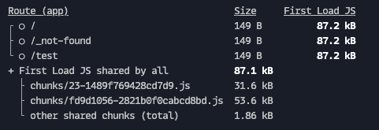
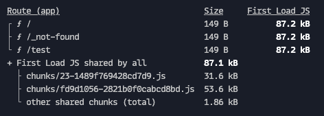

This is a reproduction of a static build issue with Next.js and the `not-found.tsx` page.

## Issue

By making `not-found.tsx` use a dynamic function (`headers()`), it also opts the home page (and all routes that would use `not-found.tsx`) out of static generation.

## Steps to reproduce
1. run `pnpm build` and see that the home page and `/test` are both statically generated

2. uncomment the lines in `app/not-found.tsx`
3. run `pnpm build` again and see that the home page and `/test` are both now dynamically generated

